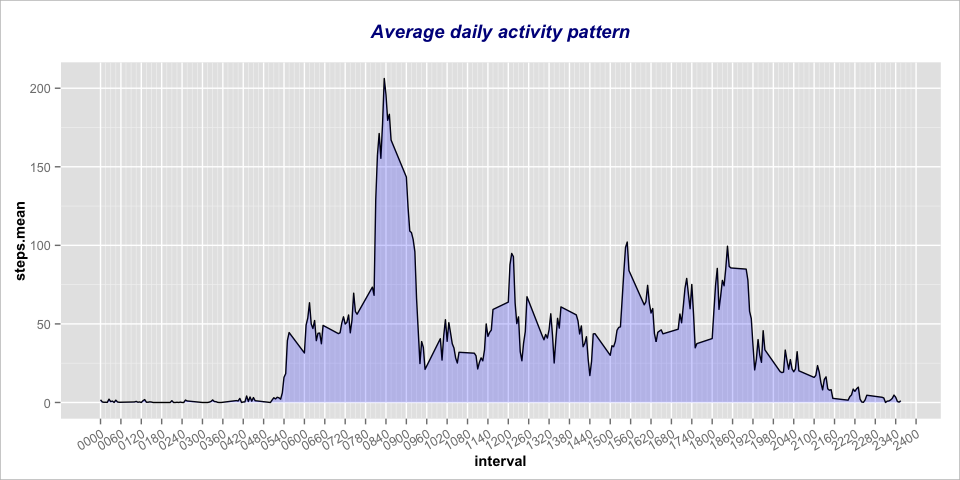
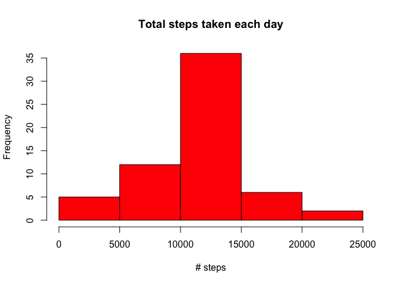
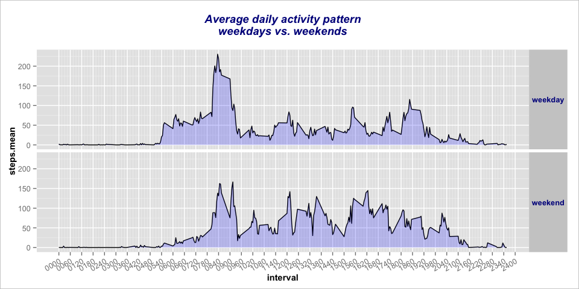

# Reproducible Research: Peer Assessment 1
  


This assignment makes use of data from a personal activity monitoring device. This device collects data at 5 minute
intervals through out the day. The data consists of two months of data from an anonymous individual collected 
during the months of October and November, 2012 and include the number of steps taken in 5 minute intervals each day.  

The code uses (some of) the libaries below.


```r
# Get libraries
library(lubridate,		quietly = TRUE, warn.conflicts=FALSE)
library(qdapTools,		quietly = TRUE, warn.conflicts=FALSE)
library(dplyr,			quietly = TRUE, warn.conflicts=FALSE)
library(reshape2,		quietly = TRUE, warn.conflicts=FALSE)
library(data.table,		quietly = TRUE, warn.conflicts=FALSE)
library(ggplot2,		quietly = TRUE, warn.conflicts=FALSE)
library(RColorBrewer,		quietly = TRUE, warn.conflicts=FALSE)
library(tidyr,			quietly = TRUE, warn.conflicts=FALSE)
```


```r
# myth()
# Some genereal theme options for ggplot
myth <- function(p) {
	p	<- p + theme(plot.title		= element_text(size=14, face="bold.italic",colour="darkblue"))
	p	<- p + theme(axis.title		= element_text(size=11, face="bold",	   colour="black"))
	p	<- p + theme(plot.background	= element_rect(fill="white",		   colour="grey"))

	return(p)
}
```


## Loading and preprocessing the data

Below is the code that is used to

1. Find/define the data sources
1. Load the data
1. Pre-process the data


```r
# Define data source
source_data	<- "./data/activity.csv"
source_zip	<- "./data/activity.zip"

# Create folder 'data' if it doesn't exist
if ( !file.exists("./data") ) {
	dir.create("./data")
}

# Extract the source file if it doesn't exist yet,
# download zip file first if needed
if ( !file.exists(source_data) ) {
	if ( !file.exists(source_zip) ) {
		url	<- "https://d396qusza40orc.cloudfront.net/repdata%2Fdata%2Factivity.zip"
		if ( download.file(url, method="curl", destfile="./data/activity.zip") > 0 ) {
			stop("Download error")
		}
	}
	if ( length(unzip(zipfile="./data/activity.zip", exdir="./data")) == 0 ) {
		stop("Unzip error")
	}
}
```


```r
# Load the data
# Columns: steps, date, interval
df	<- read.csv(source_data, header=TRUE, sep=",", stringsAsFactors = FALSE)

# Add column datetime, pad() needs sort=FALSE!
df	<- cbind(df,
		 datetime=parse_date_time(paste(df$date,
						pad(df$interval,4,type="numeric",sort=FALSE)),
						"ymd_hm"))
```

   


## What is mean total number of steps taken per day?
Here we calculate the total mean of steps/day; missing values in the dataset are ignored.


```r
by_date		<- group_by(df,date)
summed		<- summarise(by_date,
			     steps.sum=sum(steps),	# keep NA's, to ignore them for overall mean/median !!
			     steps.mean=mean(steps, na.rm=TRUE),
			     steps.median=median(steps, na.rm=TRUE))
total_mean	<- mean(  summed$steps.sum, na.rm=TRUE)
total_median	<- median(summed$steps.sum, na.rm=TRUE)
```

The **mean** number of steps taken per day is **10766.19**. The **median** is **10765.00**.   
   


Below is a histogram for the number of steps taken each day.   


```r
# Create plot
binsize <- diff(range(summed$steps.sum, na.rm=T))/4	# 5 bins is enough
p	<- ggplot(data=summed, aes(x=steps.sum))
p	<- p + geom_histogram(binwidth=binsize, fill="lightblue", colour="black")
p	<- p + ggtitle("Total steps taken each day\n")
p	<- p + xlab("\n# steps")
p	<- p + ylab("frequency (# days)\n")
p	<- myth(p)
p	<- p + annotate("text", label="\n\nmissing values are ignored   ",
			x=Inf, y=Inf,
			hjust=1, vjust=1, 
			size=3, fontface="bold.italic", colour="black")


print(p)
```


So, for example, there were 25 days were the number of steps made lies between 10.000 and 15.000 steps per day.   


## What is the average daily activity pattern?
The following creates a time series plot (type = "l") of the 5-minute interval (x-axis) and the
average number of steps taken, averaged across all days (y-axis).  
  
The plot for the daily activity is shown below the code. Though the intervals are 5 minutes, the x-axis shows only hourly ticks 
and the minor gridlines are at 15 minute intervals. 
    

```r
by_interval	<- group_by(df,interval)
n_days		<- length(unique(df$date))
summed		<- summarise(by_interval,
			     steps.sum=sum(steps, na.rm=TRUE),
			     steps.mean=mean(steps, na.rm=TRUE),
			     steps.avg=steps.sum/n_days)
```
  
    

```r
# Create plot
# plot(x=summed$interval, y=summed$steps.mean, type="l")
# Changed to ggplot2 
				  
i_fmt	<- function(x) {return(sprintf("%04s",x))} 
p	<- qplot(data = summed, x=interval, y=steps.mean,  geom="line")
p	<- p + scale_x_continuous(breaks=seq(0,2400,by=60),
				  minor_breaks=seq(0,2400,by=15),
				  labels=i_fmt)
p	<- p + geom_area(fill="blue", alpha=0.2)
p	<- p + ggtitle("Average daily activity pattern\n")
p	<- p + theme(axis.text.x = element_text(angle=30, hjust=1))
p	<- myth(p)

print(p)
```



```r
max_interval	<- summed[which.max(summed$steps.sum),]$interval
```

The *5-minute interval*, on average across all the days in the dataset, that contains the maximum number
of steps is the interval from *0835* to *0840*.


## Imputing missing values
There are a number of days/intervals where there are missing values (coded as NA). The presence of missing days
may introduce bias into some calculations or summaries of the data.


```r
missings	<- sum(!complete.cases(df))
```

The *total number of missing values* in the dataset (i.e. the total number of rows with NAs) is **2304**.

They will be replaced by the mean for the interval. These means are already calculated in `summed`.  As for
every day all intervals are present, we can conveniently use the `summed` dataframe to fill the missing values
in the original since it will be recycled (`summed` has one row for each interval).


```r
# df <- mutate(df, steps.imputed = ifelse(!is.na(steps), steps, summed$steps.mean))
# Replace steps immediately:
df$steps <- transmute( df,
                       steps.imputed = ifelse( !is.na(steps),
                                               steps,
                                               summed$steps.mean)
                     )[,1]
```


```r
by_date		<- group_by(df,date)
summed		<- summarise(by_date,
			     steps.sum=sum(steps, na.rm=TRUE),
			     steps.mean=mean(steps, na.rm=TRUE),
			     steps.median=median(steps, na.rm=TRUE))
total_mean	<- mean(summed$steps.sum)
total_median	<- median(summed$steps.sum)
```

The **mean** number of steps taken per day is **10766.19**. The **median** is **10766.19**.   


Here is the histogram for the total steps per day based on the data set with the missing data imputed.   


```r
# Create plot
binsize <- diff(range(summed$steps.sum, na.rm=T))/4	# 5 bins is enough
p	<- ggplot(data=summed, aes(x=steps.sum))
p	<- p + geom_histogram(binwidth=binsize, fill="lightblue", colour="black")
p	<- p + ggtitle("Total steps taken each day\n")
p	<- p + xlab("\n# steps")
p	<- p + ylab("frequency (# days)\n")
p	<- myth(p)

print(p)
```




## Are there differences in activity patterns between weekdays and weekends?

Create a new factor variable in the dataset with two levels -- "weekday" and "weekend" indicating whether a given date
is a weekend day or not.


```r
df		<- mutate(df,
			  daycat = factor( ifelse( weekdays(datetime) %in% c("Saturday","Sunday"),
					   "weekend",
					   "weekday"))
			 )
```

Categorise by interval and the new factor variable `daycat`, then summerise to obtain the means for the respective intervals.

```r
by_intv_dcat	<- group_by(df,interval,daycat)
summed		<- summarise(by_intv_dcat, steps.mean=mean(steps, na.rm=TRUE))
```
    
Now plot the results in a panel differentiating by the category of the weekday, i.e. a working day (weekday) or the weekend.

```r
# Create plot
p	<- ggplot(summed, aes(x=interval, y=steps.mean)) + geom_line()
p	<- p + facet_grid(daycat ~ .)
p	<- p + scale_x_continuous(breaks=seq(0,2400,by=60),
				  minor_breaks=seq(0,2400,by=15),
				  labels=i_fmt)
p	<- p + geom_area(fill="blue", alpha=0.2)
p	<- p + ggtitle("Average daily activity pattern\nweekdays vs. weekends\n")
p	<- p + theme(axis.text.x = element_text(angle=30, hjust=1))
p	<- p + theme(strip.text.y=element_text(face="bold",colour="darkblue",angle=0))
p	<- myth(p)

print(p)
```



